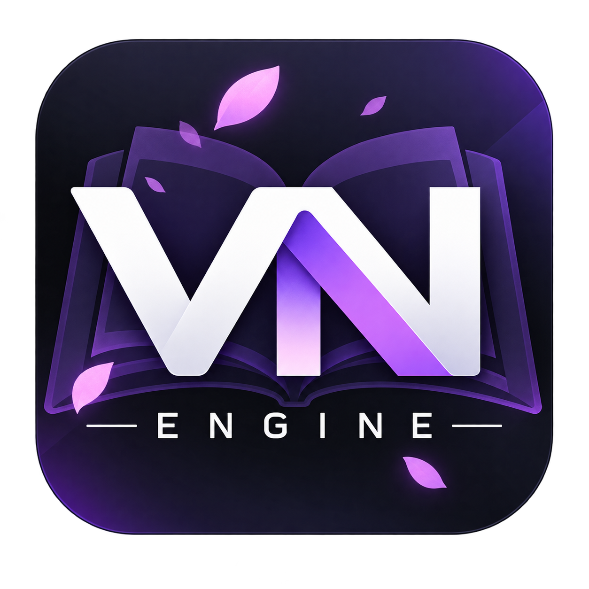
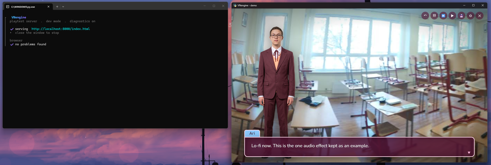
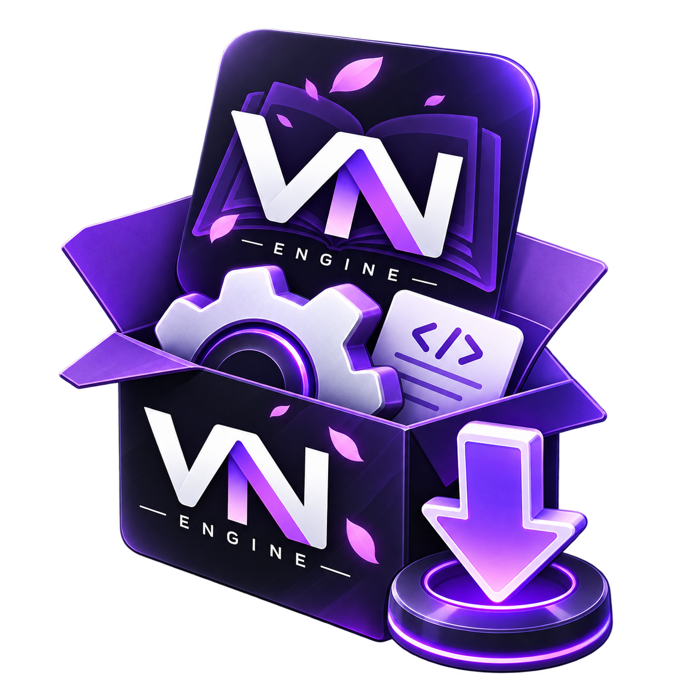
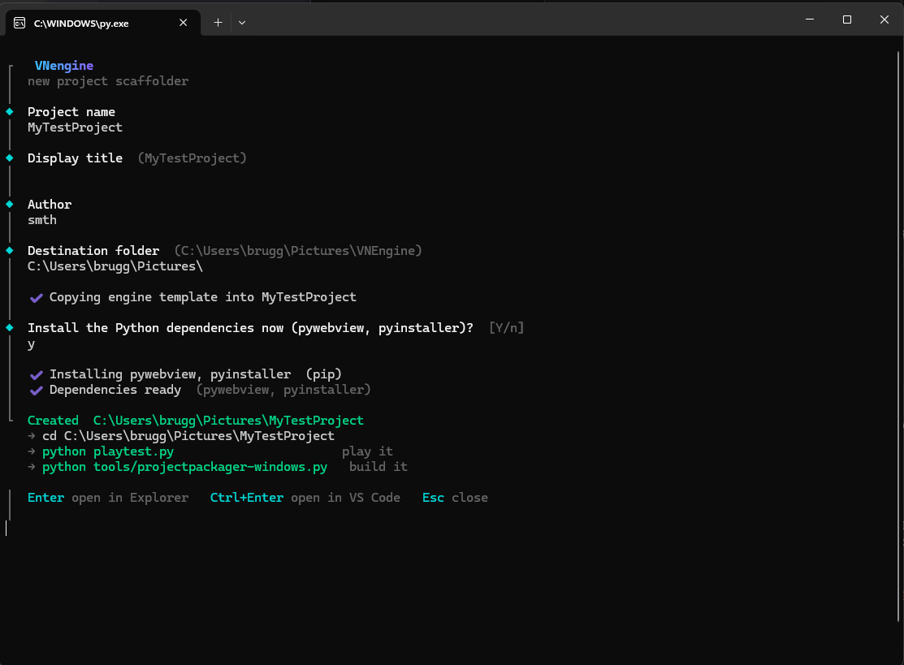
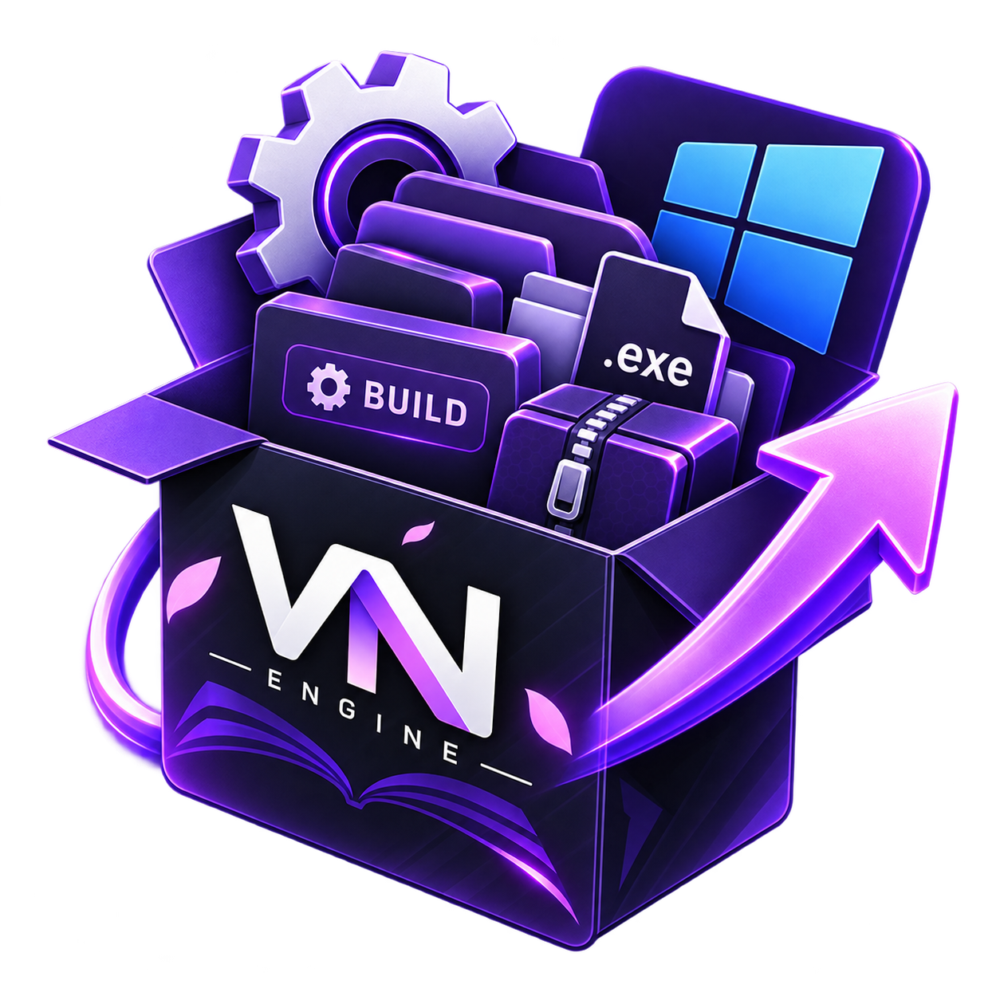
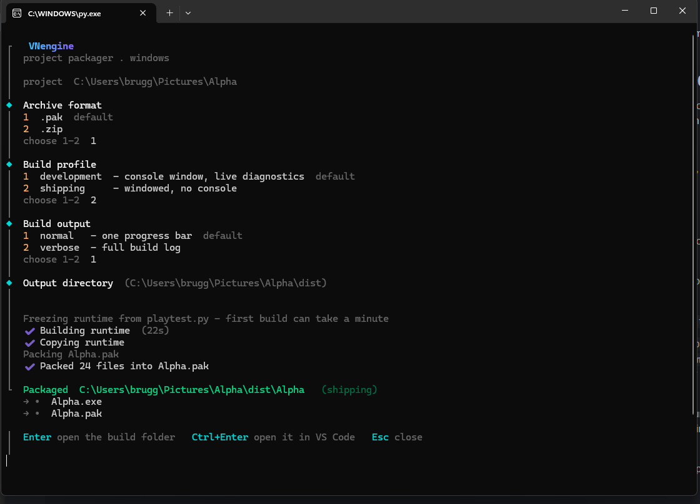

<div align="center">
  

  # VNEngine

  [](LICENSE)
  [](../../releases)
  [](../../releases)
</div>

A small, **code-first visual novel engine**. You write your novel as a
JavaScript array of "ops"; the engine plays it. No build step, no framework,
no runtime dependencies in the engine itself — four plain JavaScript files,
one stylesheet, one HTML page.

<div align="center">
  
  <br>
  <sub>The bundled demo, running via <code>playtest</code> — native window on the right, live diagnostics on the left.</sub>
</div>

It's the runtime, not the game — like an engine rather than a finished title.
Every project starts as a copy of the engine plus a tiny worked demo, so you
can see every feature running, then replace the demo with your own script.

```js
label('start'),
music('theme', { volume: 0.5, fade: 2 }),
bg('room'),
show('ari', 'idle', 'left'),
say('ari', 'Hi, {first}!', 'talk'),
choice([
  { text: 'Of course',  to: 'yes', set: { warmth: 1 } },
  { text: "Let's see",  to: 'no' }
]),
```

**It is not "just a web page."** You build with it and ship with it as a
desktop app: `playtest` and every packaged build open the game in its own
**native window** (no browser chrome, no address bar, no tab), backed by a
tiny local server that shuts itself down when you close the window. The web
platform is the rendering layer, not the delivery.

---

## Features

**Scripting** — typewriter text with tokens (`{first}` / `{last}` / `{name}` /
`{anyVar}`) and `[b]` / `[i]` / `[c=…]` markup; `label` / `jump` / `if` /
`choice` branching with conditional options and variables; `set` arithmetic.

**Presentation** — background crossfades; diffed expression sprites with a
graceful labelled-placeholder fallback when art is missing; screen shake and
flash (gated by a setting).

**Audio** — a synthesized sound-effect palette (16 built-in sounds, no files
needed) plus music with crossfade, ducking and a lo-fi band-pass effect;
per-line voice clips. `js/audio.js` is self-contained and reusable on its own.

**Player features** — rollback (50-line buffer), a backlog / history overlay,
skip (stops at choices) and auto-advance, a settings overlay, a name-entry
screen, an auto-save plus up to 30 named checkpoints that **survive script
edits** (position is anchored to the nearest label + a script hash; a stale
save shows a recovery prompt instead of breaking).

**In-world UI** — confirmations ("erase save?", "return to menu?") are themed
in-engine modals, not browser `confirm()` dialogs, so nothing ever reads
"localhost:8000 says".

**Authoring aids** — a boot-time script validator (unknown jump / choice
targets, duplicate labels, unrecognised characters or sfx, unreachable ops,
each with its op index) that reports **into the `playtest` terminal**, not
just the browser console.

**Theming** — everything reskins from the `:root` custom properties at the top
of `css/style.css`; fonts are bundled as woff2 (no CDN, nothing fetched from
the network); `localStorage` for all persistence.

---

## How it works

Three pieces, each replaceable:

| piece | what it is | where |
|---|---|---|
| **the engine** | vanilla JS/CSS/HTML — reads `VNData` (assets), `VNScript` (your ops), optional `VNAudio`; drives the DOM in `index.html` | `template/` → copied into every project |
| **`playtest.py`** | a pure-stdlib static server **and** the launcher: opens the native window, streams diagnostics, stops on window close | project root; frozen into `<Project>.exe` at package time |
| **the packager** | freezes `playtest.py` and zips the assets into one shippable folder | `tools/projectpackager-windows` |

**The window.** `playtest.py` opens the game with
[`pywebview`](https://pywebview.flowlib.org/) (WebView2 on Windows) and runs
the HTTP server on a background thread. Close the window → the server thread
is shut down and the process exits. `VN_NO_BROWSER=1` serves headlessly
(Ctrl+C to stop); if `pywebview` isn't installed it falls back to opening your
default browser.

**Diagnostics in the terminal.** Whenever `playtest.py` has a console to print
to — running from source, or a `development` build — it injects a ~60-line dev
shim (`tools/devlog.js`) into `index.html` as it serves it. The shim forwards
`console.*`, uncaught errors and failed image/audio loads back to a
`/__vn/log` endpoint, which `playtest.py` renders in the terminal (errors in
red, warnings amber, a single green "no problems found" on a clean boot). The
shim is **never referenced by `index.html` and never reaches a shipping
build**; the real F12 console still works if you want it.

**What a packaged game does.** `<Project>.exe` finds the lone `.pak` beside
it, reads `index.html` + `css/` + `js/` + `src/` + `project.json` out of it
into memory, serves them from `127.0.0.1` on the first free port, opens the
native window (titled from `project.json`), and shuts down on close. The
player installs nothing.

---



## Get started

**Download (Windows).** Grab `VNEngine-Dist.zip` from the
[Releases](../../releases) page, extract it, run `setup.exe`.

**From source.** Plain Python, open source:

```bash
python setup.py
```

Either way you answer a few prompts (name, title, author, destination).
`setup` copies the engine, writes `project.json`, and offers to
`pip install` the two packages a project needs:

- **`pywebview`** — the native play/ship window
- **`pyinstaller`** — freezes the runtime when you package

You get a **project folder** — your own copy of the engine, ready to edit,
like a fresh Unity or Unreal project.




### Play it while you build

```bash
cd <YourProject>
playtest            # or:  python playtest.py
```

Opens the game in a native window; edit `js/story.js` / `js/data.js`, reload
(the server sends `no-store`, so there's no cache to bust), repeat. The
terminal shows the boot-time script check and any runtime errors. Closing the
window stops the server.

You can still just double-click `index.html` — everything works from
`file://` including saves; the server only makes audio decoding more reliable
and adds the terminal diagnostics.



### Ship a distributable

From the project folder run the packager — `projectpackager-windows.exe` in
`tools/` (or `python tools/projectpackager-windows.py`). It asks for an
archive format, a **build profile**, and an output folder, then produces:

```
<output>/<Project>/
    <Project>.exe     the game — a self-contained local runtime
    <Project>.pak     index.html + project.json + css + js + src, packed
```

`index.html` is packed **inside** the `.pak` — there's no loose file for a
player to edit.

| profile | runtime | for |
|---|---|---|
| **development** | `--console` | your own testing — a console window streams the browser diagnostics alongside the game |
| **shipping** | `--windowed` | release — no console, `index.html` served untouched, no dev shim |

The first run of each profile freezes the runtime from your `playtest.py`
(via `tools/projectpackager-tools/build-runtime.py`) and caches it **per
profile** (keyed on a hash of `playtest.py`); later runs reuse the cache and
only rebuild when `playtest.py` changes. After that it's just copy + zip.




---

## What you edit

```
index.html        screens + the DOM the engine drives
css/style.css     all styling; theme via the :root variables at the top
js/data.js        your assets manifest  -> window.VNData     (EDIT THIS)
js/story.js       your script           -> window.VNScript   (EDIT THIS)
js/audio.js       music + sound engine  -> window.VNAudio    (reusable as-is)
js/save-resolve.js  save/position hashing + resolution (usually left alone)
js/engine.js      the runtime           (usually left alone)
src/              your images and audio
playtest.py       the local server + window launcher
project.json      name / title / author  (setup writes it; titles the window)
tools/            the packager (the "Build" step) + everything it needs
VNEngine.md       the full manual — every op, with examples
```

**Start with [`VNEngine.md`](template/VNEngine.md)** — it documents every
scripting op (`say`, `bg`, `show`, `choice`, `music`, `fx`, checkpoints, …)
with copy-paste examples.

---

## This repo

The repo holds the engine and its tooling in **Python + JS source form**; the
[Releases](../../releases) page publishes the compiled `.exe` builds
(`setup.exe`, and the packager that ships inside each project).

```
setup.py           scaffold a new project        (published as setup.exe)
template/          the engine — copied wholesale into every new project
  index.html  playtest.py  VNEngine.md
  css/  js/  src/
  tools/
    projectpackager-windows.py    the "Build" step  (published as .exe, in-project)
    devlog.js                     dev-only browser -> terminal console bridge
    projectpackager-tools/
      build-runtime.py            freezes playtest.py into the game runtime
```

`template/` is the source of truth for the engine; you never run it in place —
`setup` a copy and work in that.

---

## Status

**v0.2.1 — Windows-first.** The engine (JS/CSS/HTML) is
platform-neutral and runs anywhere a browser does. The tooling targets
Windows: the packager freezes a Windows `.exe`, and the native window uses
WebView2. Running `playtest.py` from source works on macOS/Linux too if
`pywebview` has a backend there, but that path is untested.

Stable: the scripting ops, saves/checkpoints, the validator, packaging.
Rough edges: the first frozen build per machine can take a minute; a
mis-bundled `pywebview` falls back to the default browser rather than
erroring; only a single `.pak` beside the `.exe` is supported.